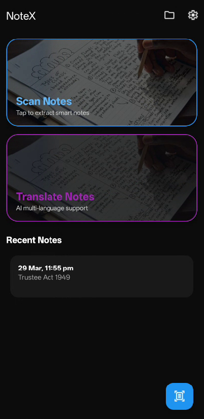
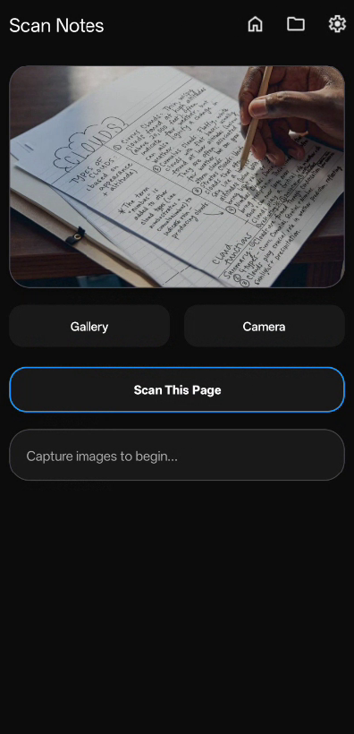
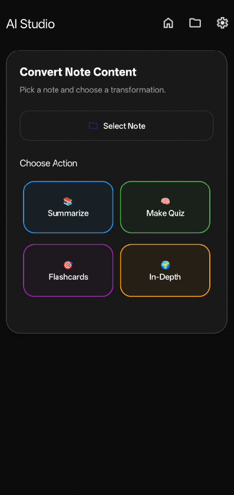
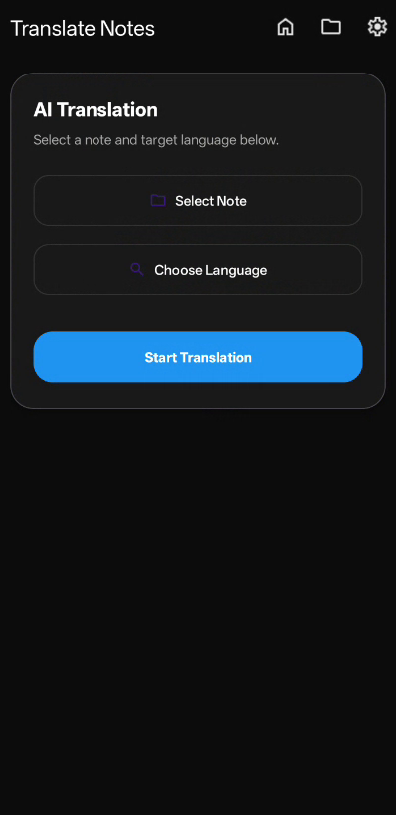

# 📘 NoteX – AI-Powered Smart Notes with OCR, Translation & AI Studio

NoteX is an Android productivity app that transforms the way you take and use notes.  
It combines OCR scanning, AI-powered transformation, and translation into a single seamless workflow.

Instead of just storing notes, NoteX helps you convert raw content into useful outputs like summaries, quizzes, flashcards, and in-depth explanations.

---

## 🚀 Features

### 📝 Smart Note Management
- Create, edit, and delete notes
- Clean and organized interface
- Smooth browsing with RecyclerView

---

### 📷 OCR Text Scanner
- Capture images and extract text instantly
- Convert handwritten or printed notes into digital format

---

### 🤖 AI Studio (Core Feature)
Turn any note into something useful with one tap:

- Summarize – Convert long notes into concise key points  
- Generate Quiz – Instantly create questions for revision  
- Flashcards – Transform notes into study cards  
- In-Depth Mode – Expand content into detailed explanations  

NoteX doesn’t just generate text — it transforms notes into actionable knowledge.

---

### ✍️ AI Enhancement
- Clean messy or unstructured text
- Improve clarity and readability
- Automatically format notes into structured content

---

### 🌍 Translation
- Translate notes into multiple languages
- Useful for multilingual users and language learners

---

### ☁️ Cloud Sync (Firebase)
- Secure user-based storage
- Access your notes across devices
- Private data separation per user

---

### ⚙️ Settings
- Simple customization options
- User-friendly configuration

---

## 🧠 How It Works

1. Input text or scan using OCR  
2. Clean and enhance content using AI  
3. Transform notes using AI Studio  
4. Translate if needed  
5. Save and access anytime  

---

## 🛠 Tech Stack

- Language: Java  
- Platform: Android  
- Database: Firebase (user-based cloud storage)  
- UI: XML + RecyclerView  

Core Integrations:
- OCR Text Recognition  
- AI Text Processing / Transformation  
- Translation API  

---

## 🎯 What Makes NoteX Different

Unlike traditional note apps, NoteX focuses on:

- Note transformation instead of just storage  
- Converting notes into quizzes, summaries, and flashcards  
- Fast, one-tap AI workflows  
- Practical use cases for students and productivity users  

---

## 📱 Screenshots

  
  
  
  

---

## 🚧 Future Improvements

- Smart AI suggestions (context-aware actions)
- Save AI outputs as structured notes (quiz sets, flashcards)
- MVVM architecture (ViewModel + LiveData)
- Room database integration (offline-first support)
- Material Design 3 UI upgrade
- Advanced AI customization (tone, difficulty, format)

---

## 👨‍💻 Author

Ilyas Akbar Khan

---

## 📄 License

For educational and portfolio use.
